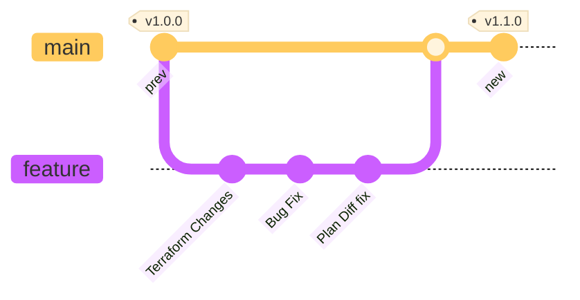
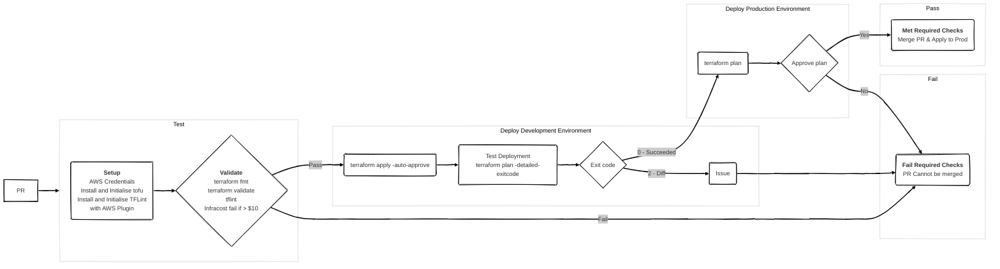

# More Than Certified GitOps MiniCamp 2024

The main purpose of this mini camp is to build a GitOps pipeline to deploy resources, managed by terraform to AWS using GitHub Actions.

   

## Table of contents

- [More Than Certified GitOps MiniCamp 2024](#more-than-certified-gitops-minicamp-2024)
  - [Table of contents](#table-of-contents)
  - [Requirements](#requirements)
  - [Workflow](#workflow)
    - [Branching Strategy](#branching-strategy)
    - [Diagram](#diagram)
    - [Workflows](#workflows)
      - [Infracost](#infracost)

## Requirements

  
Expand to see requirements

   

| **Section**             | **Task**                                  | **Self-Reported Status** | **Notes**                                                  |
| :---------------------- | :---------------------------------------- | :----------------------: | :--------------------------------------------------------- |
| **Setup**               |                                           |                          |                                                            |
|                         | Main branch is protected                  |    :white_check_mark:    |                                                            |
|                         | Cannot merge to main with failed checks   |    :white_check_mark:    |                                                            |
|                         | State is stored remotely                  |    :white_check_mark:    |                                                            |
|                         | State Locking mechanism is enabled        |    :white_check_mark:    |                                                            |
| **Design and Code**     |                                           |                          |                                                            |
|                         | Confirm Account Number                    |    :white_check_mark:    | data source post condition                                 |
|                         | Confirm Region                            |    :white_check_mark:    | variable validation                                        |
|                         | Add Default Tags                          |    :white_check_mark:    | added to provider block                                    |
|                         | Avoid Hardcoded Values                    |    :white_check_mark:    |                                                            |
|                         | No plaintext credentials                  |    :white_check_mark:    | Environment variables set by OIDC                          |
|                         | Pipeline in GitHub Actions only           |    :white_check_mark:    |                                                            |
| **Validate**            |                                           |                          |                                                            |
|                         | terraform fmt pre-commit hook             |    :white_check_mark:    | Git Hooks managed by trunk-io                              |
|                         | pre-commit hooks are in repo              |    :white_check_mark:    | Git Hooks managed by trunk-io                              |
| **Test and Review**     |                                           |                          |                                                            |
|                         | Pipeline works on every PR                |    :white_check_mark:    | `on: pull_request trigger`                                 |
|                         | Linter                                    |    :white_check_mark:    | TFLint configured with aws plugin and deep check           |
|                         | terraform fmt                             |    :white_check_mark:    | https://github.com/3ware/gitops-2024/pull/5                |
|                         | terraform validate                        |    :white_check_mark:    | https://github.com/3ware/gitops-2024/pull/5                |
|                         | terraform plan                            |    :white_check_mark:    | https://github.com/3ware/gitops-2024/pull/5                |
|                         | Infracost with comment                    |    :white_check_mark:    | https://github.com/3ware/gitops-2024/pull/4                |
|                         | Open Policy Agent fail if cost > $10      |    :white_check_mark:    | https://github.com/3ware/gitops-2024/pull/6                |
| **Deploy**              |                                           |                          |                                                            |
|                         | terraform apply with human intervention   |                          |                                                            |
|                         | Deploy to production environment          |                          |                                                            |
| **Operate and Monitor** |                                           |                          |                                                            |
|                         | Scheduled drift detection                 |                          |                                                            |
|                         | Scheduled port accessibility check        |                          |                                                            |
| **Readme**              |                                           |                          |                                                            |
|                         | Organized Structure                       |                          |                                                            |
|                         | Explains all workflows                    |                          |                                                            |
|                         | Link to docs for each action              |                          |                                                            |
|                         | Contribution Instructions                 |                          |                                                            |
|                         | Explains merging strategy                 |                          |                                                            |
| **Bonus**               |                                           |                          |                                                            |
|                         | Deploy to multiple environments           |                          |                                                            |
|                         | Ignore non-terraform changes              |    :white_check_mark:    | Workflow trigger use paths filter for tf and tfvars files. |
|                         | Comment PR with useful plan information   |    :white_check_mark:    | https://github.com/3ware/gitops-2024/pull/7                |
|                         | Comment PR with useful Linter information |    :white_check_mark:    | https://github.com/3ware/gitops-2024/pull/5                |
|                         | Open an Issue if Drifted                  |                          |                                                            |
|                         | Open an issue if port is inaccessible     |                          |                                                            |
|                         | Comment on PR to apply                    |                          |                                                            |

## Workflow

- Create feature branch off main
- Commit change locally and push to remote
- Create a draft pull request that targets the main branch: `gh pr create --draft --base main`

> [!IMPORTANT]
> Pull Request must be set to draft to prevent CODEOWNER reviewers being assigned until the pull request is ready.
> This cannot be set by default. See [open discussion](https://github.com/orgs/community/discussions/6943)
> Unfortunately this also cannot be automated because action runners, using `GITHUB_TOKEN` for authentication, are unable to run `gh pr ready --undo` as the integration is unavailable. See [open discussion](https://github.com/cli/cli/issues/8910)

- When the [Workflows](#workflows) have completed, mark the PR as ready to assign a reviewer from CODEOWNERS. (again cannot be automated on a runner)
- If the PR is approved, merge the pull request. The branch will be automatically deleted.

### Branching Strategy

### Diagram

### Workflows

#### Infracost

[Infracost](workflows/infracost.yaml) runs on pull requests when they are opened or synchronized. The workflow generates a cost difference of the resources between the main branch and the proposed changes on the feature branch. The pull request is updated with this information. <!--> # TODO: Add example here

This workflow also flags any policy violations defined in [infracost-policy.rego](../infracost/infracost-policy.rego). See an example in this [pull_request](https://github.com/3ware/gitops-2024/pull/6)

#### Terraform CI
