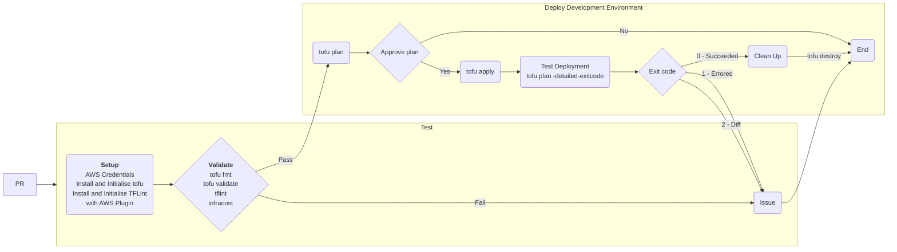

# More Than Certified GitOps MiniCamp 2024

The main purpose of this mini camp is to build a GitOps pipeline to deploy resources, managed by terraform / OpenTofu to AWS using GitHub Actions.

## Requirements

See rubric document

## Design

### Branching Strategy

TBC. Currently, feature branch of main.

<!-- ```mermaid
title: Branching Strategy
gitGraph
commit
```
-->

### Pipeline Diagram

First pass at a diagram documenting the flow of the pipeline


