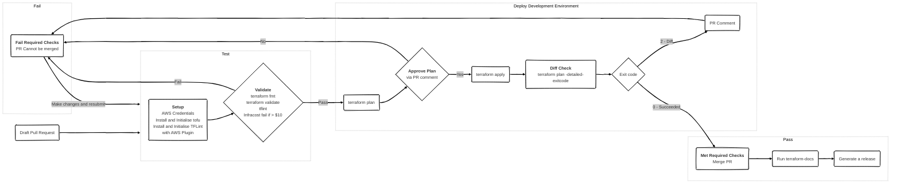

# More Than Certified GitOps MiniCamp 2024

The main purpose of this mini camp is to build a GitOps pipeline to deploy resources, managed by terraform to AWS using GitHub Actions.

   

## Table of contents

  
Table of contents

   

- [More Than Certified GitOps MiniCamp 2024](#more-than-certified-gitops-minicamp-2024)
  - [Table of contents](#table-of-contents)
  - [Requirements](#requirements)
  - [Workflow](#workflow)
    - [When to apply?](#when-to-apply)
    - [Directories vs Workspaces for multiple environments](#directories-vs-workspaces-for-multiple-environments)
    - [Branching Strategy](#branching-strategy)
    - [Diagram](#diagram)
    - [Workflows](#workflows)
      - [Infracost](#infracost)
      - [Terraform CI](#terraform-ci)
        - [Validate](#validate)
        - [Plan](#plan)
        - [Apply](#apply)
        - [Diff Check](#diff-check)
      - [Terraform Docs](#terraform-docs)
      - [Release](#release)
  - [To do list](#to-do-list)

## Requirements

  
Expand to see requirements

   

| **Section**             | **Task**                                  | **Self-Reported Status** | **Notes**                                                  |
| :---------------------- | :---------------------------------------- | :----------------------: | :--------------------------------------------------------- |
| **Setup**               |                                           |                          |                                                            |
|                         | Main branch is protected                  |    :white_check_mark:    |                                                            |
|                         | Cannot merge to main with failed checks   |    :white_check_mark:    |                                                            |
|                         | State is stored remotely                  |    :white_check_mark:    |                                                            |
|                         | State Locking mechanism is enabled        |    :white_check_mark:    |                                                            |
| **Design and Code**     |                                           |                          |                                                            |
|                         | Confirm Account Number                    |    :white_check_mark:    | data source post condition                                 |
|                         | Confirm Region                            |    :white_check_mark:    | variable validation                                        |
|                         | Add Default Tags                          |    :white_check_mark:    | added to provider block                                    |
|                         | Avoid Hardcoded Values                    |    :white_check_mark:    |                                                            |
|                         | No plaintext credentials                  |    :white_check_mark:    | Environment variables set by OIDC                          |
|                         | Pipeline in GitHub Actions only           |    :white_check_mark:    |                                                            |
| **Validate**            |                                           |                          |                                                            |
|                         | terraform fmt pre-commit hook             |    :white_check_mark:    | Git Hooks managed by trunk-io                              |
|                         | pre-commit hooks are in repo              |    :white_check_mark:    | Git Hooks managed by trunk-io                              |
| **Test and Review**     |                                           |                          |                                                            |
|                         | Pipeline works on every PR                |    :white_check_mark:    | `on: pull_request trigger`                                 |
|                         | Linter                                    |    :white_check_mark:    | TFLint configured with aws plugin and deep check           |
|                         | terraform fmt                             |    :white_check_mark:    | See PR https://github.com/3ware/gitops-2024/pull/5         |
|                         | terraform validate                        |    :white_check_mark:    | See PR https://github.com/3ware/gitops-2024/pull/5         |
|                         | terraform plan                            |    :white_check_mark:    | See PR https://github.com/3ware/gitops-2024/pull/5         |
|                         | Infracost with comment                    |    :white_check_mark:    | See PR https://github.com/3ware/gitops-2024/pull/4         |
|                         | Open Policy Agent fail if cost > $10      |    :white_check_mark:    | See PR https://github.com/3ware/gitops-2024/pull/6         |
| **Deploy**              |                                           |                          |                                                            |
|                         | terraform apply with human intervention   |    :white_check_mark:    | Applied when PR is approved                                |
|                         | Deploy to production environment          |                          | Currently deploying to _development_ environment           |
| **Operate and Monitor** |                                           |                          |                                                            |
|                         | Scheduled drift detection                 |    :white_check_mark:    |                                                            |
|                         | Scheduled port accessibility check        |                          |                                                            |
| **Readme**              |                                           |                          |                                                            |
|                         | Organized Structure                       |    :white_check_mark:    |                                                            |
|                         | Explains all workflows                    |    :white_check_mark:    |                                                            |
|                         | Link to docs for each action              |    :white_check_mark:    |                                                            |
|                         | Contribution Instructions                 |                          |                                                            |
|                         | Explains merging strategy                 |    :white_check_mark:    |                                                            |
| **Bonus**               |                                           |                          |                                                            |
|                         | Deploy to multiple environments           |                          |                                                            |
|                         | Ignore non-terraform changes              |    :white_check_mark:    | Workflow trigger use paths filter for tf and tfvars files. |
|                         | Comment PR with useful plan information   |    :white_check_mark:    | See PR https://github.com/3ware/gitops-2024/pull/7         |
|                         | Comment PR with useful Linter information |    :white_check_mark:    | See PR https://github.com/3ware/gitops-2024/pull/5         |
|                         | Open an Issue if Drifted                  |    :white_check_mark:    | See Issue https://github.com/3ware/gitops-2024/issues/20   |
|                         | Open an issue if port is inaccessible     |                          |                                                            |
|                         | Comment on PR to apply                    |    :white_check_mark:    |                                                            |

## Workflow

- Create feature branch off main
- Commit change locally and push to remote
- Create a draft pull request that targets the main branch: `gh pr create --draft --base main`

> [!IMPORTANT]
> Pull Requests must be set to draft to prevent CODEOWNER reviewers being assigned until the pull request is ready.
> This cannot be set by default. See [open discussion](https://github.com/orgs/community/discussions/6943).
> Unfortunately this also cannot be automated because action runners, using `GITHUB_TOKEN` for authentication, are unable to run `gh pr ready --undo` as the integration is unavailable. See [open discussion](https://github.com/cli/cli/issues/8910)

- The workflow will run through the tests (fmt, validate, TFLint), then run `terraform plan` and post the plan to the pull request and workflow job summary.
- To approve the plan, comment on the plan with: **terraform plan approved**
- When the [Workflows](#workflows) have completed, mark the PR as ready to assign a reviewer from CODEOWNERS. (again cannot be automated on a runner)

### When to apply?

The [debate rumbles on](https://terramate.io/rethinking-iac/mastering-terraform-workflows-apply-before-merge-vs-apply-after-merge/). In this case, because it's just me, apply before merge is fine.

### Directories vs Workspaces for multiple environments

Another debate. The best argument I have heard for directories was in the Q&A session on 19/10/2024:

> _"anyone should be able to `cd` into a terraform working directory and simply run `terraform plan` without have to worry about workspaces and variable files"_

The workflow currently runs in the _development_ directory, with a view to having a _production_ directory should time allow.

### Branching Strategy

### Diagram

### Workflows

#### Infracost

[Infracost](workflows/infracost.yaml) runs on pull requests when they are opened or synchronized. The workflow generates a cost difference of the resources between the main branch and the proposed changes on the feature branch.

This workflow also flags any policy violations defined in [infracost-policy.rego](../infracost/infracost-policy.rego). See an example in this [pull_request](https://github.com/3ware/gitops-2024/pull/6)

#### Terraform CI

##### Validate

- Setup AWS credentials using [config-aws-credentials](https://github.com/aws-actions/configure-aws-credentials) using OIDC to assume a role and set the authentication parameters as environment variables on the runner. This step is required when TFLint [deep checking](https://github.com/terraform-linters/tflint-ruleset-aws/blob/master/docs/deep_checking.md) for the AWS rule plugin is enabled.
- ~~Setup terraform using [setup-terraform](https://github.com/hashicorp/setup-terraform)~~ Not required. terraform v1.9.7 already installed on runner image.
- Run `terraform fmt`
- Run `terraform init`
- Run `terraform validate`
- Install TFLint using [setup-tflint](https://github.com/terraform-linters/setup-tflint)
- Initialise TFLint to download the AWS plugin rules.
- Run `tflint`
- Run [trunk code quality action](https://github.com/marketplace/actions/trunk-check); this runs checkov and trivy security checks.
- Update the PR comments if any of the steps fails and exit the workflow on failure.

##### Plan

When a draft pull request is opened, and the Test Terraform job has succeeded - a ` terraform plan` will be run.
The workflow uses [TF-via-PR](https://github.com/DevSecTop/TF-via-PR). This action adds a high level plan and detailed drop down style plan to the workflow summary and updates the pull request with a comment.

> [!NOTE]
> Plan will run on `pull_request` events when the test job is successful.

##### Apply

After `terraform plan` has been run, assuming the plan is satisfactory, comment on the pull request to approve the plan. The workflow will run again - this time running `terraform apply`, with `plan_parity` set, to ensure the plan has not changed.

> [!NOTE]
> Apply will run when the pull request comment body contains: **terraform plan approved** and the test workflow is skipped.
> The test workflow is skipped because it only runs on `pull_request` events. This has been tested in PR https://github.com/3ware/gitops-2024/pull/19

##### Diff Check

Following a successful apply, another plan is run to check for any diffs. If a diff is detected a pull request comment is added and the workflow exits with a failure. If a diff is not detected, the pull request can be merged.

#### Terraform Docs

[Terraform docs](https://github.com/terraform-docs/gh-actions) will run when the pull request is merged. This only needs to run once, following the apply, and not on every commit to a pull request. Updating the README on every commit generates a lot unnecessary commits and you have to pull the updated README prior to the next push to avoid conflicts.

I use my own [Terraform Docs reusable workflow](https://github.com/3ware/workflows/blob/main/.github/workflows/terraform-docs.yaml) which adds job summaries and verified commits to the [terraform-docs gh-action](https://github.com/terraform-docs/gh-actions).

#### Release

Generate a CHANGELOG and version tag using [semantic release](https://github.com/cycjimmy/semantic-release-action)

## To do list

- [ ] Grafana Port Check
- [ ] Pull request labels environment
- [ ] Job matrix / branched for multiple environments
- [ ] Update plan comment with approval text as opposed to new comment
- [ ] Replace manual terraform commands with tf-via-pr for fmt and validate now this is supported
