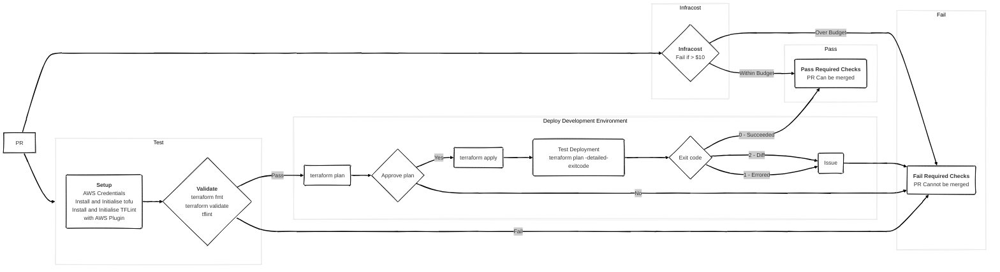

# More Than Certified GitOps MiniCamp 2024

The main purpose of this mini camp is to build a GitOps pipeline to deploy resources, managed by terraform to AWS using GitHub Actions.

[](https://github.com/semantic-release/semantic-release) [](https://github.com/3ware/workflows/gitops-2024/) [](https://github.com/3ware/gitops-2024/issues) [](https://github.com/3ware/workflows/actions/gitops-2024/wait-for-checks.yaml)

## Table of contents

- [Requirements](#requirements)
- [Workflow](#workflow)
  - [Branching Strategy](#branching-strategy)
  - [Diagram](#diagram)
  - [Infracost](#infracost)
  - [Terraform](#terraform)

## Requirements

## Workflow

### Branching Strategy

TBC. Currently, feature branch of main.

<!-- ```mermaid
title: Branching Strategy
gitGraph
commit
```
-->

### Diagram



### Infracost

### Terraform
